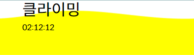
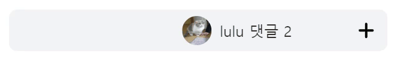

<div align=center>
  <h1> [A810] 코코와 차차 😺 </h1>
</div>

**팀정보**

> 팀　명　　|　코코와 차차 <br />
> 팀코드　　|　 A810 <br />
> 팀　장　　|　강준영 <br />
> 팀　원　　|　권소희, 김선우, 김의년, 정민영, 정재웅<br />

**포지션**

> Infra 　 　　|　김선우, 김의년 <br />
> Backend 　 |　김선우, 김의년, 정민영 <br />
> Frontend 　|　강준영, 권소희, 정재웅
> <br />

<div align=center>
  <h3>📇 목차 </h3>
</div>

[0. 서비스 개요](#📝-서비스-개요)<br />

**PART 1. 🌊 INFRA**<br />
[1. CI/CD](#🏭-cicd)<br />
┠ 　[1) Jenkins](#🔧-jenkins) <br />
┠ 　[2) Backend CI/CD](#🗝️-backend-cicd) <br />
┠ 　[3) Frontend CI/CD](#🌈-frontend-cicd) <br />

**PART 2. 🌊 BACKEND**<br />
[2. Spring Security + JWT + OAuth 2.0 (카카오 로그인)](#2-spring-security--jwt--oauth-20-카카오-로그인)<br />
┠ 　[1) 개요](#🔧-개요) <br />
┠ 　[2) Spring Security](#🔐-spring-security) <br />
┠ 　[3) JWT](#🎫-jwt) <br />
┠ 　[4) OAuth 2.0 (카카오 로그인)](#🗝️-oauth-20-카카오-로그인) <br />

**PART 3. 🌊 FRONTEND**<br />
[3. 프로젝트 기본 설정](#🦴-프로젝트-기본-설정--bundler-issue) <br />
┠ 　[1) yarn](#1-yarn)<br />
┠ 　[2) npm](#2-npm)<br />
[4. 컴포넌트 개발](#🧩-컴포넌트-개발) <br />
┠ 　[1) 컴포넌트 목록 및 담당 팀원](#컴포넌트-목록-및-담당-팀원) <br />
[5. 페이지 라우팅 설정](#⚙️-페이지-라우팅-설정) <br />
┠ 　[1) 구조 설계](#1-구조-설계)<br />
┠ 　[2) 반영](#2-반영)<br />
[6. 페이지 View 개발](#🔧-view-개발) <br />
┠ 　[1) 활동 페이지 ](#1-활동-페이지-코드-바로가기) <br />
┠ 　[2) 결과 페이지 ](#2-결과-페이지-코드-바로가기) <br />
┠ 　[3) 시작 페이지 ](#3-시작-페이지) <br />
┠ 　[4) 메인 페이지 ](#4-메인-페이지) <br />

---

## 📝 서비스 개요

**🌊 서비스명 : CHAEUM (채움)**

**📌 주요 기능**

1. 나의 활동을 "스트릭" 이라는 시각적 수단으로 기록한다.
2. 이 활동은 실시간으로 "타이머" 를 통해 사용자, 라이벌, 친구가 확인할 수 있으며, 동기 부여 문구를 통해 자극을 받는다.
3. 끝난 활동은 "피드"로 저장하여 자세하게 기록한다.

**😊 기대 효과**

1. 스트릭울 통한 시각적 기록, 타이머를 통한 활동 시간 측정, 사용자 맞춤 동기부여 문구를 통해 스스로 동기부여를 얻을 수 있다.
2. 피드에 활동 기록을 올리고 다른 사람의 기록을 보면서 자극을 얻을 수 있다.

```javascript
`최종목표` : 사용자에게 동기부여하여 활동을 지속적으로 이어갈 수 있도록 한다.
```

---

<div align=center>
  <h1> 🌊 PART 1　|　INFRA </h1>
</div>

# 🏭 CI/CD

```
환경 : AWS EC2
사용 : Dokcer 위에 Jenkins, Nginx를 이용한 FrontEnd 빌드
그 외 : 도커 및 jenkins를 사용하면서 알게된 점을 기록
```

## 🔧 Jenkins

> `Jenkins` : 굉장히 유명하고 개발자들이 많이 사용하는 CI 도구

#### [ Jenkins 사용 이유 ]

1. 개발자들이 많이 사용하고 있어서 참고할 자료가 굉장히 많다. 그래서 문제가 생겼을 때, 해결하기 수월하다.
2. 개발자의 편의를 위해서 많은 plugin을 제공해준다.
3. GUI로 관리해서 편하다.
4. JAVA 기반이라 JDK, Gradle, Maven 설정을 할 수 있다. 그래서 JAVA기반의 프로젝트를 빌드하기 쉽다.
   - 젠킨스를 처음 설치할 때, 자바 버전을 설정할 수 있는데 이것이 JDK다.
   - 본인 프로젝트와 맞는 버전으로 설정한 후 설치해야한다.

#### [ Docker 사용 이유 ]

- 젠킨스를 설치하는 과정이 굉장히 복잡하다.
- 하지만, 도커를 사용하면 이 과정을 한 번에 처리할 수 있다.
- 즉, 개발자에게 **굉장한 편의**를 주기 때문에 사용한다.

#### Dokcer 위에 Jenkins 설치

```jsx
sudo docker run -d --name jenkins -p 8080:8080 jenkins/jenkins:jdk
```

- jdk 부분에 본인 프로젝트에 맞는 jdk를 쓰면 된다.
  - `lts`라고 쓰면 jdk 11 버전
  - 안쓰면 가장 최신 버전

### ⚙️ Jenkins 설정

`{본인 EC2 서버}:8080`으로 접속 가능

#### (1) 초기 비밀번호

- 첫 접속을 하면 초기 비밀번호를 치라고 나오는데, 아래 명령어를 통해서 확인할 수 있다.

```jsx
// jenkins 컨테이너에 접속
$ sudo docker exec -it jenkins bash
// 초기 관리자 키 확인
// 방법 1.
$ cat /var/jenkins_home/secrets/initialAdminPassword
// 방법 2.
$ sudo docker logs jenkins
```

- sudo docker logs jenkins를 하면 중간에 초기 비밀번호가 있다.

#### (2) plugin 설치

- 기본 plugin을 설치할 수 있다.

  

- 만약에 다 실패하고 에러가 `connection time out`이라면 EC2를 초기화 하고 다시 하는 것을 추천
- 그 후 유저 설정하고 실행을 하면 된다,

### 🎁 젠킨스 아이템 (FreeStyle vs Pipeline)


#### (1) Freestyle

- 전통적으로 젠킨스에서 사용된 아이템 방식으로 GUI 기반으로 빌드 단계를 설정한다.
- 복잡한 스크립트 없이 간단하게 만들 수 있다.

#### (2) Pipeline

- 스크립트를 사용해, 스크립트를 재사용 가능하다.
- 빌드, 테스트, 배포 등 전체 CI/CD 에 대해 단일 파일로 관리가 가능하다.
- 이번 프로젝트에서는 프론트엔드, 백엔드 그리고 앞으로 있을 프로젝트에서의 스크립트 재사용성을 위해서 파이프 라인을 사용하였다.


<br><br>

pipeline을 사용하기 위해서는 다음과 같은 곳에 스크립트를 작성해야 한다.

1. 젠킨스 웹 내에서 스크립트를 작성하여 관리 → Pipeline Script(default)
2. 프로젝트 내에서 Jenkinsfile에 스크립트를 작성하여 관리 → Pipeline Script from SCM
   <br><br>

- 현재 프로젝트에서는 1번 방법을 사용하였다.

### 🔐 Credentials 설정

#### Credentials란?

- 젠킨스에서 보안 관련 정보를 저장하는데 사용된다.
- name, value의 값으로 원하는 이름을 사용해서 중요한 정보를 사용할 수 있다.


- 사용자 정보를 클릭하게 되면 왼쪽 화면에 이렇게 뜨게 된다.
- Credentials를 누르면 다음과 같이 현재까지 등록한 보안 자격 증명들이 표시된다.

<br><br>


## 🗝️ BackEnd CI/CD

### 📌 Backend CI

#### (1) `Git Clone`

```jsx
stage('Git Clone') {
  steps {
	  git branch: 'develop',
		credentialsId: 'CocoChachaBe',
		url: 'https://lab.ssafy.com/s09-webmobile2-sub2/S09P12A810.git'
  }
}
```

- git branch 는 git clone을 할 프로젝트의 branch를 선택하면 된다.
- url은 clone을 할 프로젝트의 url을 넣어주면 된다.
- credentialsId는 젠킨스에서 설정한 credentials에서 현재 클론을 받을 프로젝트 access token에 해당하는 name을 적어주면 된다.

  - credentialsId를 사용하는 이유는 프로젝트가 private로 설정되어 있어서 access token이 필요해서 사용한다.
  - credentialsId를 사용하지 않고 가능한 방법도 있다.
    <br><br>
    

  - GitLab Connection을 통해서 연결이 가능하다.

#### (2) `BE-build`

```jsx
stage('BE-Build') {
    steps {
        dir("./BE/chaeum-backend") {
            sh '''
            chmod +x ./gradlew
            ./gradlew clean build
            '''
        }
    }
}
```

- `dir("./BE/chaeum-backend")`
  - 빌드 파일인 gradlew 가 들어있는 폴더로 들어가기 위해 작성됐다.
- `chmod +x ./gradlew`
  - gradlew 파일의 실행 권한이 없어서 권한을 부여해주었다
- `./gradlew clean build`
  - 이미 빌드가 되어 있다면 지우고 새롭게 빌드를 하기 위한 코드이다.
  - ci/cd 가 지속적으로 이루어지기 때문에 새롭게 빌드를 하기위해 clean을 넣어주었다.

### 📌 Backend CD

#### CD 설정 구축하기

#### [ ssh를 위한 플러그인 설치 ]

- 해당 플러그인을 설치하는 이유는 참고한 블로그에서 아래와 같은 이슈 해결을 위한 방법이다.

> 🚫 `Publish Over SSH 접속 불가 이슈`<br /><br />
> 구글에서 Jenkins Pipeline 생성을 다룬 게시글들을 검색하여 찾아보면 스프링이 실행될 운영서버 EC2의 접근을 위한 SSH 플러그인으로 Publish Over SSH를 사용하는 것을 볼 수 있었다. 하지만 Publish Over SSH 플러그인은 현재 아래 링크의 설명에서 볼 수 있듯이 최신의 openssh 버전이 ssh-rsa 방식의 암호화 키를 비활성화 시킨 것을 알 수 있다. 우리의 운영서버 EC2로의 접근을 하기 위한 pem는 rsa 방식으로 암호화되었기에 해당 플러그인에서 연결이 불가능하다는 것을 확인하여 다른 플러그인을 사용하기로 결정했다.

1. 젠킨스 관리 → 플러그인 → available plugins 에서 ssh agent 검색 후 install 한다,

   

2. credentials에 SSH Username with private key를 선택한다.

   

3. private key direct를 선택하고 pem키를 다음과 같이 넣어준다.
4. 다음과 같이 설정하면 aws에 접근 가능하다

   

5. 그렇다면 이제 파이프라인에 대해 알아보자

### 📌 `Deploy`

```jsx
stage('Deploy') {
    steps {
        sshagent(credentials: ['aws_key']) {
            sh '''
                ssh -o StrictHostKeyChecking=no ubuntu@i9a810.p.ssafy.io uptime
                chmod +x ./backend/deploy.sh
                ssh -t -t ubuntu@i9a810.p.ssafy.io /home/ubuntu/jenkins/jenkins1/workspace/CocoChachaBE/backend/deploy.sh
            '''
        }
    }
}
```

- `ssh -o StrictHostKeyChecking=no ubuntu@i9a810.p.ssafy.io uptime`
  - 젠킨스 서버에서 운영 서버에 접근할 수 있도록 StrickHostKeyChecking을 비활성화한다.
- 블로그 글에서는 scp를 통해서 jar 파일을 운영서버로 옮기는 작업이 있는데 바인드 마운트를 통해서 이 작업을 하지 않아도 됐다.
- `chmod +x ./backend/deploy.sh`
  - deploy.sh의 실행권한을 부여해줬다.
- `ssh -t -t ubuntu@i9a810.p.ssafy.io /home/ubuntu/jenkins/jenkins1/workspace/CocoChachaBE/backend/deploy.sh`
  - deploy.sh의 절대 경로를 사용해서 deploy.sh를 실행 시켜주었다.

#### deploy.sh 파일

```jsx
#!/bin/bash

pid=$(pgrep -f chaeum-backend)

if [ -n "${pid}" ]
then
        kill -15 ${pid}
        echo kill process ${pid}
else
        echo no process
fi

chmod +x /home/ubuntu/jenkins/jenkins1/workspace/CocoChachaBE/BE/chaeum-backend/build/libs/chaeum-backend-0.0.1-SNAPSHOT.jar
nohup java -jar /home/ubuntu/jenkins/jenkins1/workspace/CocoChachaBE/BE/chaeum-backend/build/libs/chaeum-backend-0.0.1-SNAPSHOT.jar &

sudo disown -h

echo "끝."
```

- `/bin/bash` 를 통해서 다음 코드들을 실행시키게 했다.
- pid ~ fi 까지의 코드는 chaeum-backend 라는 이름으로 프로세스가 돌아가고 있는지 확인 후 있다면 프로세스를 죽이는 코드이다.
- jar파일의 실행 권한을 부여해주고 백그라운드에서 실행시키기 위해서 nohup & 을 사용하였다.
  - 하지만 이 과정에서 nohup & 부분의 코드가 실행되지 않는 오류가 있어서 `sudo disown -h` 코드를 통해서 실행을 강제로 해주었다.
  - `sudo disown -h` 는 실제로 존재하지는 않는 코드라서 배포가 완료 되지만 젠킨스에서는 오류가 뜬걸로 나왔다. 이걸 해결 하기 위해서 에러가 아닌 의미 없는 에코 코드를 추가 해주었다.

### ⚙️ Webhook 설정


- Build Triggers에서 Build when a change is pushed to GitLab. GitLab webhook 을 선택한다.
- 고급을 클릭해서 Secret token을 발급 받을 수 있다.

  - 발급을 하게 되면 gitlab 프로젝트 웹훅 설정에 들어간다.

    

  - URL에는 젠킨스에서 Build when a change~~ 에서 제일 옆에 보면 있는 URL을 넣어주면 된다.
  - secret token은 젠킨스에서 받은 secret token을 설정해주면 된다

- 다음과 같이 설정이 끝났다면 깃랩 웹훅 설정에서 원한는 트리거를 설정해주면 된다.


- 왼쪽 밑에 보면 gitlab push 트리거가 보이면서 잘 설정된 것을 볼 수 있다.
- 이렇게 되면 CI/CD 구축 완료!

## 🌈 FrontEnd CI/CD

### 🔧 배포 서버에 Nginx 설치하기

#### (1) Nginx 설치

- 우리는 Docker를 통해서 Nginx를 설치했다.
- 또한 Nginx에서 빌드를 하기때문에 해당 파일을 ubuntu환경에서 가져오기 위해서 바인드 마운트를 진행했다.
  - 바인드 마운트 : **컨테이너 안과 밖(ubuntu) 환경을 공유해서 해당 폴더에 있는 파일은 컨테이너 안과 밖에서 사용할 수 있게 해주는 기술**로, 컨테이너 안의 파일을 사용하기 위해서 해당 기술을 사용함

```jsx
docker run -d --name webserver -p -v {host 폴더}:{container 폴더} 80:80 nginx
```

#### (2) Nginx 설정 바꿔주기

- 먼저 nginx로 들어가기
  ```jsx
  sudo docker exec -it webserver /bin/bash
  ```
- 아래의 경로로 가서 파일 수정
  ```jsx
  /etc/nginx/conf.d/default.conf
  ```
  - 최신 버전에는 해당 위치에 설정 파일이 다 있는데, 옛날에는 아니었다.
    - `/etc/nginx/sites-available/default`옛날에는 해당 위치였다.
- 아래처럼 수정
  ```jsx
  location / {
          root   /build/build;
          index  index.html index.htm;
      }
  ```
  - root는 빌드가 될 위치로 해주면 된다.
  - 처음에 이 말이 이해가 안됐다. ⇒ 아직 빌드를 안했는데 어떻게 빌드할 곳을 알지?
  - 하지만, nginx는 빌드를 한 파일을 올려서 구동을 시키는 서버라는 것을 이해한 후, 추후에 빌드가 된 파일을 해당 위치에 옮기면 된다는 것을 깨달았다.
  - 그렇지만, 또 문제가 생겼는데 도커 컨테이너 안이라서 빌드한 파일을 해당 위치로 옮길 수가 없었다. ⇒ 이 때를 위해서 **바인드 마운트**를 사용했다.

### 🔧 Jenkins에 NodeJS 플러그인 설치

```jsx
Jenkins관리 -> System Configuration에 Plugins -> Available plugins에서 NodeJS 검색 후 설치
```

#### [ NodeJS 설정하기 ]

```jsx
Jenkins관리 -> Tools 아래에 NodeJS installations가 있음
```


- 버전에 맞게 골라주면 된다.

### 🎁 프론트 CI/CD item 생성

- 백엔드 처럼 만들면 되기 때문에 pipeline만 작성할 것

```jsx
pipeline {
    agent any
    stages {
        stage('Git Clone') {
            steps {
                git branch: 'develop',
                credentialsId: 'CocoChachaBe',
                url: 'https://lab.ssafy.com/s09-webmobile2-sub2/S09P12A810'
            }
        }
        stage('FE-build') {
            steps {
                dir("./FE/chaeum-frontend") {
                    nodejs(nodeJSInstallationName: 'NodeJS18.16.1') {
                        sh 'npm install && npm run build'
                    }
                }
            }
        }
        stage('Compression') {
            steps {
                dir("./FE/chaeum-frontend") {
                    sh '''
                    rm -rf node_modules
                    tar -cvf build.tar build
                    '''
                }
            }
        }
        stage('Deploy') {
            steps {
                sshagent(credentials: ['aws_key']) {
                    sh '''
                        pwd
                        chmod +x ./frontend/deploy.sh
                        ssh -t -t ubuntu@i9a810.p.ssafy.io /home/ubuntu/jenkins/jenkins1/workspace/euinyunTestFE/frontend/deploy.sh
                    '''
                }
            }
        }
    }
}
```

#### (1) `stage('Git Clone')`

```jsx
git branch: 'develop',
credentialsId: 'CocoChachaBe',
url: 'https://lab.ssafy.com/s09-webmobile2-sub2/S09P12A810'
```

- 해당 파이프 라인이 실행될 브랜치를 정해주면 된다.
  - 우리는 git flow를 따라가서 develop에 가면 배포를 하기 때문에 develop branch로 들어오면 실행하게 했다.
  - credentialsId : `git clone`을 하기 위해서 필요한 access_token
  - url : `git url`

#### (2) `stage('FE-build')`

```jsx
dir("./FE/chaeum-frontend") {
		nodejs(nodeJSInstallationName: 'NodeJS18.16.1') {
			sh 'npm install && npm run build'
      }
}
```

- `git url` 에서 해당 주소로 들어가면 frontend 파일이 있다.
- 빌드를 위해서 nodejs를 설정 해준 후, 빌드 진행
- `npm install` 한 후, `npm run build` 로 빌드 진행
  - npm install은 우리한테 node_modulues가 없기 때문에 진행했다.

#### (3) `stage('Compression')`

```jsx
dir("./FE/chaeum-frontend") {
		sh '''
		rm -rf node_modules
		tar -cvf build.tar build
		'''
}
```

- 크기가 큰 node_modules 를 제거
- node_modules를 제거 후 build라는 위치에 build.tar로 압축한다.

#### (4) `stage('Deploy')`

```jsx
sshagent(credentials: ['aws_key']) {
		sh '''
				chmod +x ./frontend/deploy.sh
				ssh -t -t ubuntu@i9a810.p.ssafy.io /home/ubuntu/jenkins/jenkins1/workspace/euinyunTestFE/frontend/deploy.sh
		'''
		}
}
```

- 처음에 실행을 하면 권한이 없어서 `permission denied` 에러가 발생한다
  - 실행 권한을 부여한다. ⇒ chmod +x
- deploy.sh파일을 실행한다.

#### (5) deploy.sh

```jsx
mv ./jenkins/jenkins1/workspace/euinyunTestFE/FE/chaeum-frontend/build.tar /home/ubuntu/nginx/build

tar -xvf /home/ubuntu/nginx/build/build.tar -C /home/ubuntu/nginx/build
rm -rf /home/ubuntu/nginx/build/build.tar
sudo docker restart webserver
```

- mv를 통해서 파일의 위치를 옮긴다.
- tar -xvf를 통해서 압축을 해제한다.
  - -C/home/ubuntu/nginx/build라는 위치에 풀리게 설정한다.
  - 이 위치가 nginx에서 설정한 build/build와 바인드 마운트 된 주소다.
  - 즉, 빌드된 파일이 build/build안에 위치한다.
- rm을 통해서 압축 파일은 제거한다.
- 그리고 nginx를 재실행한다.

위 과정을 수행하면 프론트엔드 CI/CD는 마무리가 된다.

<div align=center>
  <h1> 🌊 PART 2　|　BACKEND </h1>
</div>

# 2. Spring Security + JWT + OAuth 2.0 (카카오 로그인)

## 🔧 개요

OAuth 2.0(Open Authorization 2.0)은 인증을 위한 개방형 프로토콜이다. 이를 통해 사용자는 본 서비스(CHAE:UM)에 가입할 때 ID와 패스워드를 넘겨주지 않아도 되고, 본 서비스에서는 유저의 ID와 패스워드를 보관하지 않아도 된다는 장점이 있다. 본 프로젝트에서는 Spring Security, JWT, OAuth 2.0, 카카오 로그인을 사용하여 서비스의 로그인과 회원가입을 처리하고, api 요청에 대한 인증과 인가를 진행한다.

## 🔐 Spring Security

- `UserPersonalInfo.java` 엔티티는 `org.springframework.security.core.userdetails.UserDetails`를 구현한다.
- `/config/oauth` 패키지의 `OAuth2UserCustomService.java`는 OAuth2 사용자 정보를 처리하기 위한 `org.springframework.security.oauth2.client.userinfo.DefaultOAuth2UserService`를 확장한 커스텀 구현체이다. 리소스 서버에서 보내주는 사용자 정보를 불러오는 `loadUser()`를 통해 사용자를 조회하고, 사용자가 DB에 있다면 해당 객체를 가져오고, 없다면 사용자 객체를 새로 만들어 저장한 뒤 반환한다.
- `/config/oauth` 패키지의 `OAuth2AuthorizationRequestBasedOnCookieRepository.java`는 `org.springframework.security.oauth2.client.web.AuthorizationRequestRepository`를 구현한다. 이는 권한 인증 흐름에서 클라이언트의 요청을 유지하는 데 사용된다.
- `/config/oauth` 패키지의 `OAuth2SuccessHandler.java`는 인증 성공 시 실행할 핸들러이다. 리프레시 토큰을 생성, 저장, 쿠키에 저장하고, 엑세스 토큰을 생성, 패스에 추가한다. 그리고 인증 관련 설정값과 쿠키를 제거하고 엑세스 토큰이 패스에 추가된 URL로 리다이렉트된다.
- `/config/oauth` 패키지의 `WebOAuthSecurityConfig.java`를 통해 OAuth2, JWT에 필요한 웹 보안 구성을 설정한다.
  - 토큰 방식 인증을 위해 폼로그인과 세션을 비활성화하고, 헤더를 확인하기 위한 커스텀 필터인 `TokenAuthenticationFilter.java`를 추가한다.
  - `/api/token`을 제외한 모든 `/api`요청은 인증을 필요로 하도록 한다.
  - `http.oauth2Login().authorizationEndpoint()`에 대하여 `/oauth2/authorize`를 baseUri로 설정하여 해당 uri로 리다이렉트 되었을 때 OAuth 인증을 실행한다. 본 프로젝트에서는 `OAuthLoginController.java`에서 `/oauth2/authorize/kakao`로 리다이렉트 되면서 실행된다.
  - 인증 요청과 관련된 상태를 저장할 저장소와 인증 성공 시 실행할 핸들러도 설정한다.
  - /api로 시작하는 url인 경우 인증에 실패했을 때 401 상태 코드(Unauthorized)를 반환한다.

## 🎫 JWT

- 본 프로젝트에서는 토큰 기반 인증을 위해 `/config/jwt` 패키지의 `JwtProperties.java`와 `TokenProvider.java`파일을 통해 토큰을 생성하고, 올바른 토큰인지 유효성 검사를 하고, 토큰에서 필요한 정보를 가져온다.
- 또한 `RefreshToken.java` 엔티티와 `RefreshTokenRepository.java` 리포지터리를 통해 (기본키, 유저ID, 토큰값)과 같이 컬럼을 설계하여 DB에 저장할 수 있도록 했다.
- `/config` 패키지의 `TokenAuthenticationFilter.java`는 Authorization 헤더값을 가져온 뒤 엑세스 토큰이 유효하다면 인증 정보를 설정한다. 이를 통해 백엔드 서버 내에서는 `SecurityContextHolder.getContext().getAuthentication()`을 통해 사용자의 인증 정보를 전역적으로 접근할 수 있다.
- `RefreshTokenService.java`는 리프레시 토큰으로 DB의 리프레시 토큰 정보를 검색해서 전달하고, `TokenService.java`는 전달받은 리프레시 토큰의 유효성을 검사하여 유효하다면 해당 사용자의 새로운 엑세스 토큰을 생성한다. `TokenApiController.java`에서는 `TokenService.java`를 이용해 `POST /api/token` 요청에 대해 새로운 엑세스 토큰을 발급한다.

## 🗝️ OAuth 2.0 (카카오 로그인)

- [kakao developers 카카오 로그인 문서](https://developers.kakao.com/docs/latest/ko/kakaologin/common)

### 시퀀스 다이어그램

인증, 인가 및 토큰 재발급 흐름은 아래 시퀀스 다이어그램으로 대체한다.


---

<div align=center>
  <h1> 🌊 PART 3　|　FRONTEND </h1>
</div>

# 🦴 프로젝트 기본 설정 : Bundler Issue

초기 계획은 bundler로 `npm`이 아닌 `yarn`을 사용하려 했으나 `Storybook`이 yarn berry를 제대로 지원하지 않아 초기 설정에 실패하여 `npm`으로의 사용으로 전환했다.

## 1) yarn

`yarn`은 ver 1인 `yarn classic`과 ver 2 이상인 `yarn berry`가 있다. `yarn`의 장점인 zero-install을 위해서는 `yarn berry`가 필요하여 해당 버전으로 프로젝트의 뼈대를 잡으려고 했다.

그러나 (예상컨데) `yarn berry`의 특성 상 호이스팅 이슈가 발생할 수 있는데, 해당 이슈로 인하여 storybook의 일부 모듈을 찾을 수 없었다.

## 2) npm

현재 사용하고 있는 번들러는 `npm`이다. 현재 기획한 서비스의 규모에서는 `yarn berry`를 굳이 고집할 필요가 없어 오류 해결에 결국 실패한 후 `npm`으로의 회귀를 택했다.

CI/CD를 통해 배포한 결과, build에는 약 1분 30초 내외가 걸렸다. 추후 프로젝트의 구현이 어느정도 완료 되면 migration을 다시 진행해 볼 예정인데, 그 때 `yarn`으로 build를 했을 때와의 시간 차를 알 수 있을 것이다.

통상적으로는 최소 30초 이상 차이가 난다고 알고 있다.

# 🎨 메인 로고 제작

앱 내에서 사용할 로고 제작 : 기존 로고에 물결 효과 추가


# 🧩 컴포넌트 개발

## 컴포넌트 목록 및 담당 팀원

|       컴포넌트명       | 담당자 | 지라이슈번호 |
| :--------------------: | :----: | :----------: |
|    **텍스트 버튼**     | 강준영 |     #134     |
|    **아이콘 버튼**     | 강준영 |     #161     |
|     **input tag**      | 강준영 |     #162     |
|        **모달**        | 강준영 |     #173     |
|   **활동 개요 카드**   | 강준영 |     #178     |
|     **문구 카드**      | 강준영 |     #175     |
|       **타이머**       | 강준영 |     #176     |
|    **미디어 인풋**     | 강준영 |     #179     |
|    **스토리 카드**     | 강준영 |     #180     |
| **스토리 디테일 카드** | 강준영 |     #182     |
|    **미디어프리뷰**    | 강준영 |     #188     |
|     **1일 스트릭**     | 권소희 |     #194     |
|     **6주 스트릭**     | 권소희 |     #195     |
|    **스트릭 카드**     | 권소희 |     #167     |
|    **스트릭 랭킹**     | 권소희 |     #169     |
|        **태그**        | 권소희 |     #168     |
|    **프로필 카드**     | 권소희 |     #190     |
|     **알림메시지**     | 권소희 |     #184     |
|        **버블**        | 권소희 |     #174     |
|    **라이벌 카드**     | 권소희 |     #177     |
|       **Header**       | 권소희 |     #193     |
|       **NavBar**       | 권소희 |     #192     |
|      **textarea**      | 정재웅 |     #163     |
|      **dropdown**      | 정재웅 |     #164     |
|       **로딩창**       | 정재웅 |     #165     |
|     **색상라디오**     | 정재웅 |     #170     |
|   **활동 내역 카드**   | 정재웅 |     #171     |
|    **응원글/댓글**     | 정재웅 |     #172     |
|    **아티클 카드**     | 정재웅 |     #181     |
|   **아티클 디테일**    | 정재웅 |     #183     |
|    **채팅 프리뷰**     | 정재웅 |     #185     |
|    **메세지 박스**     | 정재웅 |     #186     |
|    **텍스트캐러셀**    | 정재웅 |     #226     |

### 1) 텍스트 버튼 ([코드 바로가기](./code/TextButton.tsx))

> 내부에 글자가 들어가는 버튼


#### `props`

| 변수명 | 설명                                |
| ------ | ----------------------------------- |
| icon?  | 소셜로그인을 할 때 사용하는 아이콘  |
| type   | 버튼 종류. type을 통해 배경색 결정. |
| size   | 버튼의 크기                         |
| label  | 버튼 내부에 들어가는 글자           |

### 2) 아이콘 버튼 ([코드 바로가기](./code/CustomIconButton.tsx))

> 내부에 아이콘이 있는 버튼으로 `material-tailwind/react`의 IconButton과 중복을 피하기 위해 Custom을 붙였다.


#### `props`

| 변수명     | 설명                 |
| ---------- | -------------------- |
| icon       | 사용할 아이콘의 종류 |
| colorInput | 사용할 배경색        |

<br>

### 3) input tag ([코드 바로가기](./code/InputTag.tsx))

> 입력창 정의


#### `props`

| 변수명 | 설명                            |
| ------ | ------------------------------- |
| label  | Input 태그 내부에 들어가는 글자 |

### 4) 모달 ([코드 바로가기](./code/Modal.tsx))

> 기존 모달에 버튼을 넣어 특정 동작을 수행할 수 있도록 커스터마이징한 컴포넌트


#### `props`

| 변수명  | 설명        |
| ------- | ----------- |
| title   | 상단 제목   |
| content | 내부 내용   |
| button1 | 첫번째 버튼 |
| button2 | 두번째 버튼 |

### 5) 활동 개요 카드 ([코드 바로가기](./code/ActivityOutlineCard.tsx))

> 활동이 끝나고 난 후, 피드 작성 페이지에서 간단히 내가 한 활동에 대한 개요를 보여주는 카드. 물결 애니메이션이 적용되어 있다.



#### `props`

| 변수명 | 설명               |
| ------ | ------------------ |
| color  | 배경 색            |
| tag    | 활동에 포함된 태그 |
| time   | 활동 시간          |

### 6) 문구 카드 ([코드 바로가기](./code/PhraseCard.tsx))

> 동기부여 문구 카드. 활동 중에 표시되며 제목과 내용으로 구성.


#### `props`

| 변수명 | 설명          |
| ------ | ------------- |
| title  | 제목          |
| ment   | 동기부여 멘트 |

### 7) 타이머 ([코드 바로가기](./code/Timer.tsx))

> 타이머. <br />
> 일시정지/시작하기 버튼과 초기화 버튼. 추후 서비스에 맞게 커스터마이징 후 사용할 예정이다.


### 8) 미디어 인풋 ([코드 바로가기](./code/MediaInput.tsx))

> 피드 작성 페이지에서 이미지를 추가할 때 사용하는 컴포넌트.


### 9) 스토리 카드 ([코드 바로가기](./code/StoryCard.tsx))

> 피드 페이지에서 친구가 활동중일때 볼 수 있는 컴포넌트. 물결 애니메이션이 적용되어 있다.


#### `props`

| 변수명   | 설명                        |
| -------- | --------------------------- |
| color    | 배경색                      |
| img      | 친구의 프로필 사진          |
| nickname | 친구의 닉네임               |
| ment     | 친구의 소개멘트             |
| tag      | 친구가 진행중인 활동의 태그 |
| time     | 친구의 활동 진행시간        |

### 10) 스토리 디테일 카드 ([코드 바로가기](./code/StoryDetailCard.tsx))

> 스토리카드를 클릭하면 펼쳐지는 컴포넌트. 친구의 활동정보를 자세히 볼 수 있으며 응원글을 달 수 있고 좋아요 버튼을 누를 수 있다. 아직 props를 적용하지는 않았지만 추후에 적용할 예정이다.


#### `props`

| 변수명       | 설명                                  |
| ------------ | ------------------------------------- |
| userNickname | 친구의 닉네임                         |
| tag          | 친구가 진행중인 활동의 카테고리(태그) |
| nickname     | 닉네임                                |
| profileImag  | 프로필 이미지                         |
| content      | 응원글 내용                           |

### 11) 미디어프리뷰 ([코드 바로가기](./code/MediaPreview.tsx))

> 채팅 페이지에서 사진을 첨부할 때 사용하는 컴포넌트.


### 12) 1일 스트릭

> 하루치 활동 정보를 표시할 1일 스트릭


#### `props`

| 변수명 | 설명                            |
| ------ | ------------------------------- |
| color  | 사용자 커스텀 색상              |
| weight | 활동 시간에 따른 색상 명도 변화 |

### 13) 6주 스트릭

> 스트릭 영역에 표시될 전체 스트릭을 표시할 6주 스트릭. 날짜를 계산해서 마지막 주차에는 오늘 요일까지만 스크릭 개수를 띄워준다.


#### `props`

| 변수명 | 설명                             |
| ------ | -------------------------------- |
| color  | 사용자 커스텀 색상               |
| info   | 활동 정보 배열 : 날짜, 시간 포함 |

### 14) 스트릭 카드

> 스트릭 정보와 그 외 요소들을 넣은 스크릭 카드


#### `props`

| 변수명 | 설명                                |
| ------ | ----------------------------------- |
| title  | 스트릭 이름                         |
| tags   | 스트릭 카테고리 및 유저 커스텀 태그 |
| color  | 사용자 커스텀 색상                  |
| info   | 활동 정보 배열 : 날짜, 시간 포함    |

### 15) 스트릭 랭킹

> 해당 카테고리에서 상위 5명을 보여줄 컴포넌트


#### `props`

| 변수명   | 설명                                                     |
| -------- | -------------------------------------------------------- |
| userlist | 프로필 사진, 유저 닉네임, 시간을 속성으로 가진 객체 배열 |

### 16) 태그

> 스트릭과 프로필 카드에 들어갈 태그 커스터마이징


#### `props`

| 변수명 | 설명                            |
| ------ | ------------------------------- |
| color  | 사용자 커스텀 색상              |
| weight | 활동 시간에 따른 색상 명도 변화 |

### 17) 프로필 카드

> 마이 페이지에서 보여질 유저의 기본 정보. MBTI 및 나이를 추가로 입력 시 태그 형식으로 출력한다. 프로필 사진은 카카오톡 기본 프로필 사진이 제공되므로 `undefined`는 없을 예정이다.


#### `props`

| 변수명  | 설명                  |
| ------- | --------------------- |
| name    | 유저 이름             |
| age     | 나이 (선택)           |
| mbti    | MBTI (선택)           |
| longest | 최장 스트릭 유지 기간 |
| profile | 프로필 이미지         |

### 18) 알림메시지

> 친구 신청 알림과 덧글 알림. 두 알림의 구성 요소가 달라 `props`로 어느 요소인지 받아서 출력한다.

1. 덧글 알림 <br />
   

2. 친구 신청 알림 <br />
   

### 19) 버블

> 활동 중에 띄워질 라이벌들의 정보를 담을 버블. 물결이 출렁거리는 애니메이션이 들어간다.


### 20) 라이벌 카드

> 활동 후에 띄워질 라이벌들의 정보를 담을 버블. 물결이 출렁거리는 애니메이션이 들어간다.


### 21) Header

> 필요한 영역에서 화면 최상단에 고정으로 띄워질 헤더. 필요한 아이콘 버튼을 import하여 기능을 수행하도록 할 예정이다.


#### `props`

| 변수명 | 설명                             |
| ------ | -------------------------------- |
| title  | 현재 페이지의 이름               |
| isLogo | 로고 헤더인지 체크               |
| icon   | 우측에 띄워줄 아이콘 버튼의 타입 |

### 22) NavBar

> 필요한 영역에서 화면 하단에 고정으로 띄워질 네비게이션 바. 3가지 요소로 구성되어 있으며 각각 라우터를 연결할 예정이다.


### 23) textarea

> 긴 글을 입력 받을 수 있는 커스터마이징 된 text area


#### `props`

| 변수명           | 설명          |
| ---------------- | ------------- |
| inputPlaceholder | 플레이스 홀더 |

### 24) dropdown

> 커스터마이징 된 dropdown


### 25) 로딩창

> 요청 도중 노출시킬 로딩스크린. 스피너 대신 로고가 채워지는 애니메이션이 들어가 있다.


#### `props`

| 변수명      | 설명                              |
| ----------- | --------------------------------- |
| isFadingOut | 애니메이션 효과 (페이드아웃 여부) |

### 26) 색상라디오

> 스트릭 생성 및 수정 시 사용할 색상 팔레트.


#### `props`

| 변수명     | 설명         |
| ---------- | ------------ |
| color      | 색상         |
| hoverColor | 호버 시 색상 |

### 27) 활동 내역 카드

> 스트릭과 피드에서 사용할 활동 정보를 담은 카드 컴포넌트.


### 28) 응원글/댓글

> 응원글 및 댓글을 볼 수 있는 컴포넌트.


#### `props`

| 변수명    | 설명        |
| --------- | ----------- |
| articleId | 아티클 번호 |

### 29) 아티클 카드

> 피드 내 게시글 정보를 담은 컴포넌트.


### 30) 아티클 디테일

> 게시글 상세보기를 선택할 시 보이는 상세한 게시글 정보 컴포넌트.

현재 : 아티클 카드 + 댓글 리스트

- 게시글 상세를 다른 페이지로 이동하는 형식으로 변경하면서 컴포넌트 분리 필요
- 추후 피드 페이지 구성 전에 컴포넌트를 따로 분리할 예정

### 31) 채팅 프리뷰

> 채팅방에 입장하기 전에 채팅 목록에서 보일 최근 채팅 정보.


### 32) 메세지 박스

> 채팅을 전송했을 때 메시지를 담고 있을 영역.


### 33) 텍스트캐러셀

> 응원글을 띄워줄 캐러셀.



#### `props`

| 변수명    | 설명        |
| --------- | ----------- |
| articleId | 아티클 번호 |

# ⚙️ 페이지 라우팅 설정

## 1) 구조 설계

페이지 이름과 Route 경로를 정했고, views에 저장되는 페이지의 이름을 지정했다.


## 2) 반영

설계 내용을 기반으로 `App.tsx`에 Routes태그 내부 Route 요소를 작성했다. 같은 기능의 페이지라면 하위 Route로 묶어서 직관적으로 접근할 수 있게 구성했다. (예시 : /feed/write)


# 🔧 View 개발

## 1) 활동 페이지

라이벌들의 활동시간이 보인다. 해당 활동들은 원 안에 액체가 채워지는 애니메이션을 삽입했다.


## 2) 결과 페이지

### (1) 결과 페이지 1

해당 페이지는 carousel을 적용하여 옆으로 넘길 수 있게 구성했다.
첫 페이지에서는 간단히 시작 시간, 종료 시간, 활동 시간을 볼 수 있다.


### (2) 결과 페이지 2

두번재 페이지에서는 활동을 진행할 때 달렸던 친구의 응원글을 볼 수 있다.
그 밑에는 매칭됐던 라이벌들의 카드를 볼 수 있다. 활동 중일 경우 물결이 치는 듯한 애니메이션을 볼 수 있다.
공유하기 버튼을 누르면 Routes에 등록된 피드 작성 페이지(FeedWritePage)로 이동한다.


## 3) 시작 페이지

로그인 이전 절차들을 위한 페이지들 제작했다.

**요소**

- 이용약관
- 페이지 전환 fade-in / fade-out 애니메이션
- 닉네임 중복체크를 위한 임시 함수
- State를 기반으로 한 컴포넌트 교체로직

### (1) 대문

소셜로그인을 위한 대문 페이지


### (2) 이용약관

이용약관 페이지


### (3) 회원가입

회원가입 페이지


## 4) 메인 페이지

로그인 후 가장 먼저 보일 `채움`의 메인 페이지

 


<br />

**요소**

- 스트릭 목록
- 스트릭 추가, 삭제, 수정
- 각 스트릭은 카테고리 별 swipe가 가능한 캐러셀로 제작

### 😭 ISSUE

**문제점**

```
`state`의 변화로 인해 리렌더링 되는 과정에서
애니메이션의 실행 속도보다 렌더링이 늦게 되는 현상이 발생.
따라서 애니메이션 실행 시 버벅임이 있다.
```

**시도했던 해결 방안**

1. `state`가 변할 때 불러온 하위 컴포넌트를 `hidden` 요소로 제어
2. 삼항 연산자로 tailwind class Name 조성하기
3. 모든 요소에 `duration` 추가

**시도해 볼 해결 방안**

`useMemo` 또는 `useRef`를 이용해 아코디언 생성

- 위 Hooks는 성능 최적화를 위해 사용되는 훅으로, 단순히 리렌더링을 막기 위해 사용하는 것은 지양해야 한다.
- 하지만 근본적으로 렌더링을 막으려면 토글을 컨트롤할 `state`를 없애야하고 대안으로 사용할 수 있는 요소가 위의 두 hooks 뿐이다.
- 그나마 `useRef`보다는 `useMemo`가 리렌더링 방지를 위해 자주 사용되므로 해당 요소를 먼저 테스트할 예정이다.
