# CHAEUM
## 목차
[1. 배경 및 개요](#배경-및-개요) <br>
[2. 주요 기능](#주요-기능) <br>
[3. 기술 스택](#기술-스택) <br>
[4. 파일 구조](#파일-구조) <br>
[5. 협업 툴 및 환경](#협업-툴-및-환경) <br>
[6. 팀원 역할 분배](#팀원-역할-분배) <br>
[7. 프로토 타입](#프로토-타입) <br>
[8. 아키텍쳐](#아키텍쳐) <br>
[9. 컨벤션](#컨벤션) <br>
[10. API DOCS](#API-DOCS) <br>
[11. ERD](#ERD) <br>
[12. 포팅메뉴얼](#포팅메뉴얼) <br>
[13. 시연](#시연) <br>
<hr>

### 배경 및 개요
```
요즘에는 인스타나 트위터를 통해서 활동을 기록하고 공유하는 문화가 자연스럽다. 또한 다른 사람이 공유한 게시글, 피드를 보며 자극을 받는 경우도 있다. 이러한 사람들을 위해서 동기부여 앱을 만들려고 한다.  
```

<br>

### 주요 기능
```
아래 시연에서 자세하게 보여드리겠습니다. 
```

#### 활동
- 활동 시작을 통해서 채움을 할 수 있음
- 활동 중에는 나와 친구한 사람들이 보내주는 응원들이 보임
  
#### 라이벌 보여주기
- 나와 같은 활동을 하는 사람들이 보임
- 장,단기 목표를 주기위해서 라이벌과 시간 차이가 작은 사람 부터 큰 사람까지 보여줌
  
#### 스트릭 꾸미기
- 스트릭 이름, 스트릭 태그, 스트릭 분류, 스트릭 색상들을 설정할 수 있음
- 스트릭 삭제를 통해서 스트릭의 정보를 사용안할 수 있음
- 스트릭 비활성화를 통해서 스트릭을 사용안할 수 있음 => 삭제와 다른 점은 스트릭 정보는 사용함

#### 게시글
- 활동 종료 후, 자신이 한 활동에 대해서 게시글을 작성 가능
- 해당 게시글에는 활동 시간 등 활동에 관한 것들이 반드시 들어감
- 게시글의 댓글은 활동할 때 받은 응원과 공유가 됨

<br>

### 기술 스택
#### BackEnd
- IntelliJ IDE
- Spring boot
- Spring Data JPA
- Spring Security
- Spring Web
- MySql
- MongoDB
<br>

#### FrontEnd
- Visual Studio Code IDE
- TypeScript
- React
- Redux Toolkit
- Tailwind css
- Webpack
- npm
<br>

#### CI/CD
- AWS EC2
- Jenkins
- NGINX
- SSL
<br>

#### Infra
- S3
- Docker
<br>

### 파일 구조
#### FrontEnd
```
chaeum-front
  ├── public
  │	  └── icon
  └── src
      ├── assets
      ├── components
      │   ├── active
      │   │   └── result
      │   ├── chat
      │   ├── common
      │   ├── feed
      │   │   └── write
      │   ├── main
      │   │   └── styles
      │   ├── profile
      │   │   └── screen
      │   ├── signup
      │   ├── styles
      │   └── theme
      ├── features
      │   └── states
      ├── hooks
      ├── stories
      │   └── assets
      └── views
```


#### BackEnd
```
chaeum-backend
  ├── config
  │   ├── jwt
  │   └── oauth
  ├── controller
  ├── dto
  ├── domain
  ├── repository
  ├── service
  └── util

```
<br>

### 협업 툴 및 환경
#### 협업 툴
- Git
- Notion
- JIRA
- MatterMost

#### 협업 환경
- Gitlab
  - Git flow 전략에 맞게 개발을 진행
  - Git Commit Convention, Git Merge Convention
  - 코드의 버전을 관리
  - 이슈 발행, 해결을 위한 토론 => 이거 했나?
  - Merge Request시, 팀원이 코드 리뷰를 진행
- JIRA
  - 매주 목표량을 설정하여 Sprint진행
  - 업무의 할당량을 정하여 Story Point를 설정, In-Progress -> Done 순으로 작업
- 회의
  - 아침 스크럼 : 전날 목표 달성량과 당일 할 업무 브리핑
  - 저녁 스크림 : 오늘 해결 달성량과 미해결된 목표 공유
    - 금요일 저녁 스크럼은 주간 스크럼으로 진행
    - 주간 스크럼은 KPT 및 해당 주 회고
  - 소통으로 팀원들의 개발 속도 확인 가능함
- Notion
  - 회의가 있을 때마다 회의록을 기록하여 보관
  - 회의가 길어지지 않도록 다음날 제시할 안건을 미리 기록
  - 기술 확보 시, 다른 팀원들도 추후 따라할 수 있도록 보기 쉽게 작업
  - 컨벤션 정리
  - 간트 차트 관리
  - 기능명세서 등 모두가 공유해야 하는 문서 관리

### 팀원 역할 분배
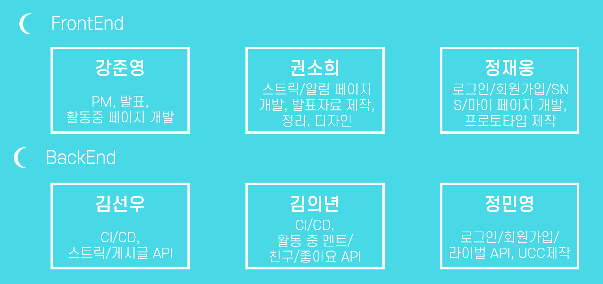 
<br>

### 프로토 타입
#### 색상 지정
 
<br>

#### 회원 가입/로그인
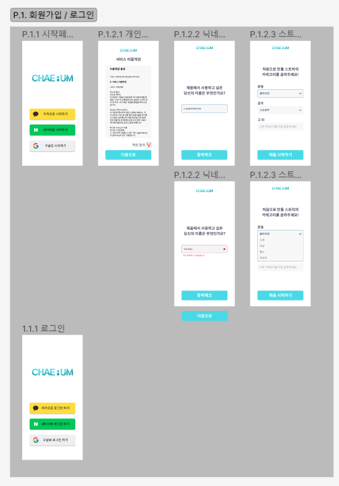 
<br>

#### 메인 페이지
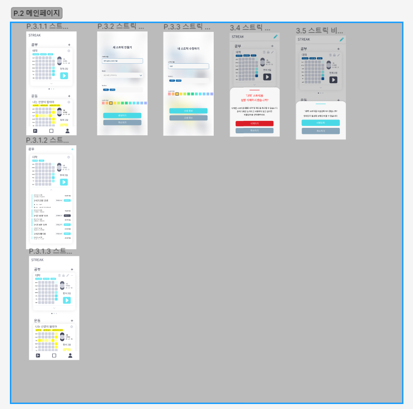 
<br>

#### 액티브
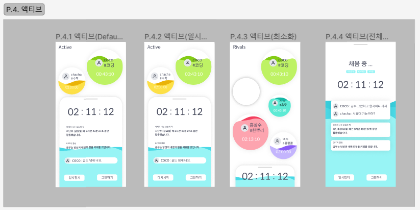 
<br>

#### 결과
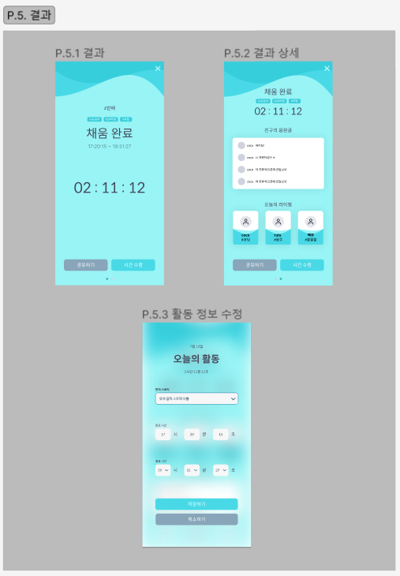 
<br>

#### 피드
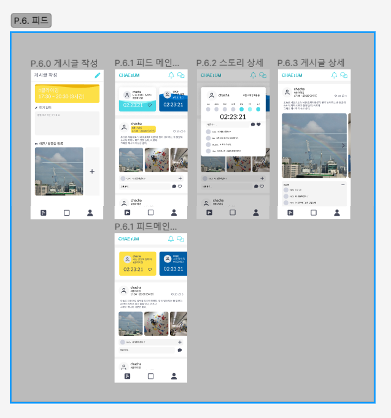 
<br>

#### 알림
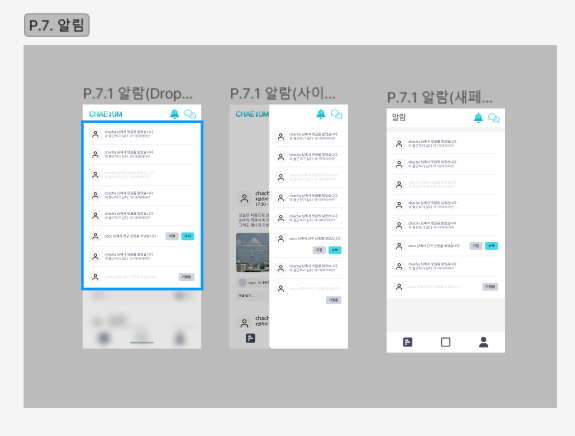 
<br>

#### 마이페이지
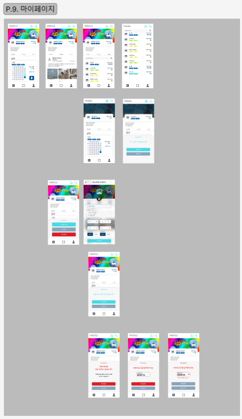 
<br>

### 아키텍쳐
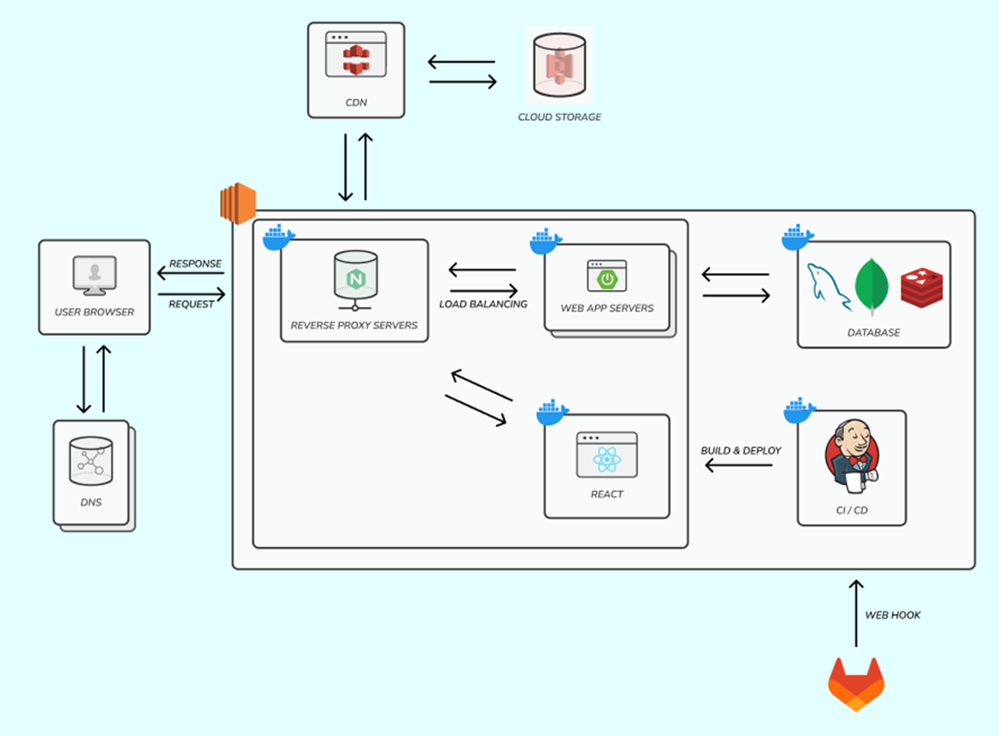 
<br>

### 컨벤션
<a href='./exec/Convention'>해당 링크를 통해서 자세히 확인 가능</a>
<br>

### API DOCS
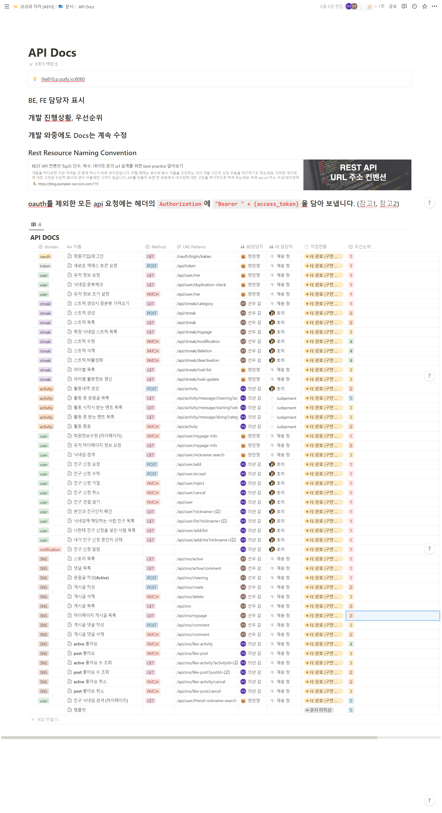 
<br>

### ERD
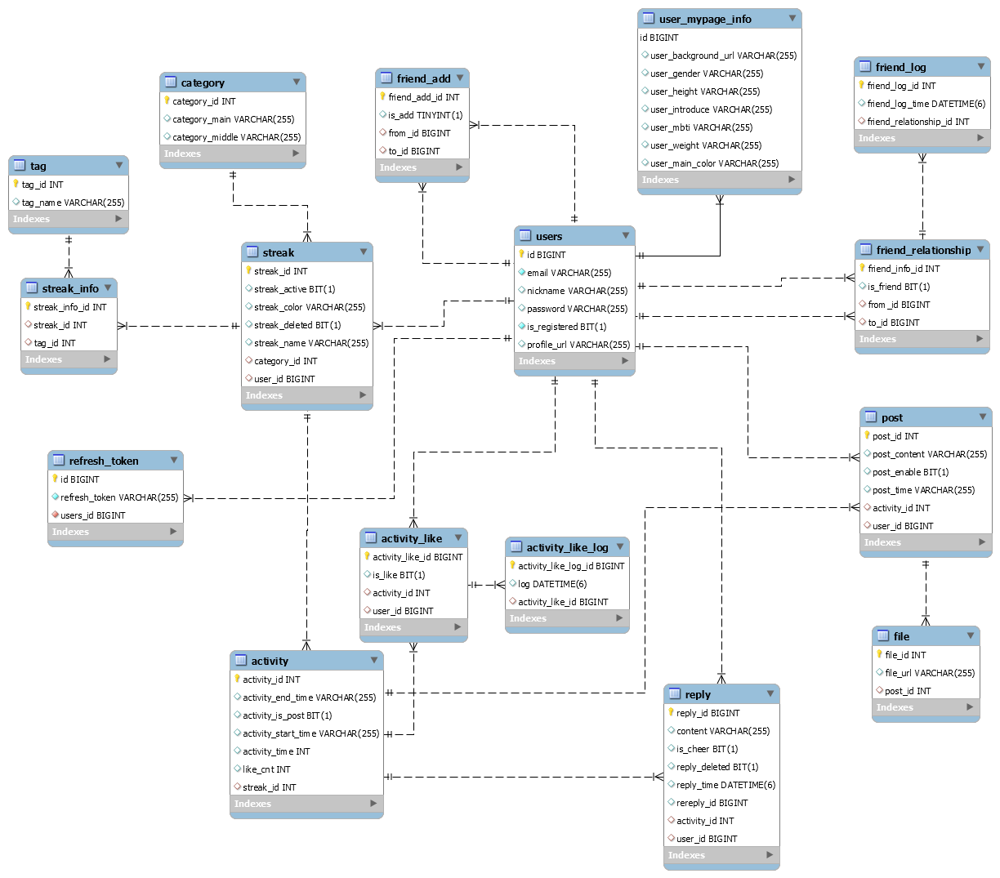 
<br>

### 포팅메뉴얼
<a href='./exec'>포팅메뉴얼에서 확인 가능</a>
<br>

### 시연
#### 활동 시작
 
<br>
- 시작 버튼을 클릭해서 활동을 시작
- 활동을 시작하면 라이벌들이 보임
<br><br>

#### 활동 중
 
<br>
- 현재 본인이 얼마나 진행 했는지 확인 가능
- 본인을 응원한 사람의 응원글 확인 가능
- 본인의 활동에 대한 동기부여 멘트 확인 가능
<br><br>

#### 활동 종료
 
<br>
- 본인이 활동 했을 때 생성되었던 라이벌의 목록 확인 가능
- 활동 종료 후, 본인이 받은 응원글의 목록 확인 가능
<br><br>

#### 피드
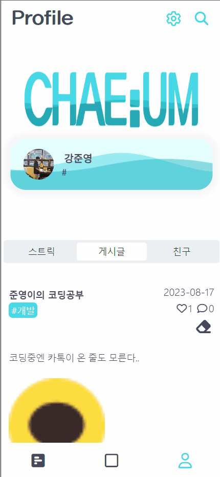 
<br>
- 다른 사람들이 작성한 피드를 확인 할 수 있음
<br><br>

#### 상세 피드
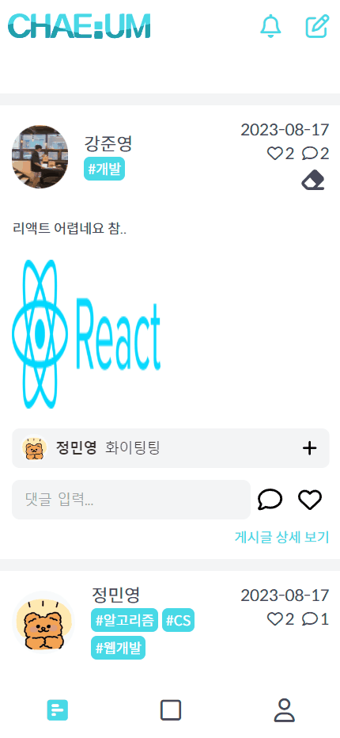 
<br>
- 다른 사람이 작성한 피드를 상세히 볼 수 있음
<br><br>

#### 마이페이지
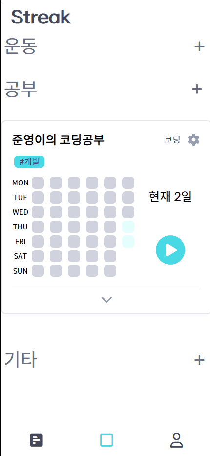 
<br>
- 마이페이지에서 다른 피드 페이지로 넘어갈 수 있음
<br><br>

#### 나의 게시글
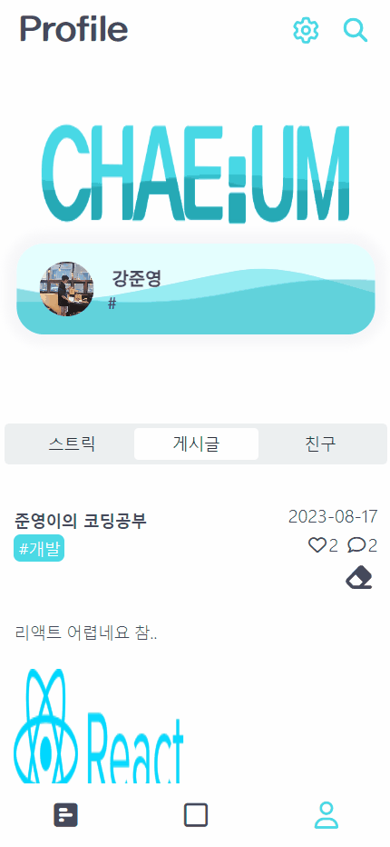 
<br>
- 마이 페이지에서 내가 쓴 피드를 확인 할 수 있음
<br><br>

#### 스트릭 생성
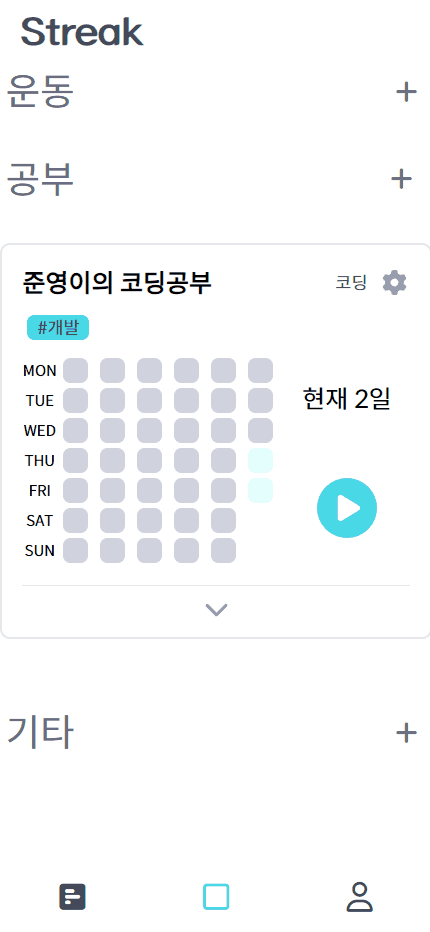 
<br>
- 스트릭 생성 버튼을 통해서 스트릭 생성 화면으로 이동 가능
<br><br>

#### 스트릭 생성 완료
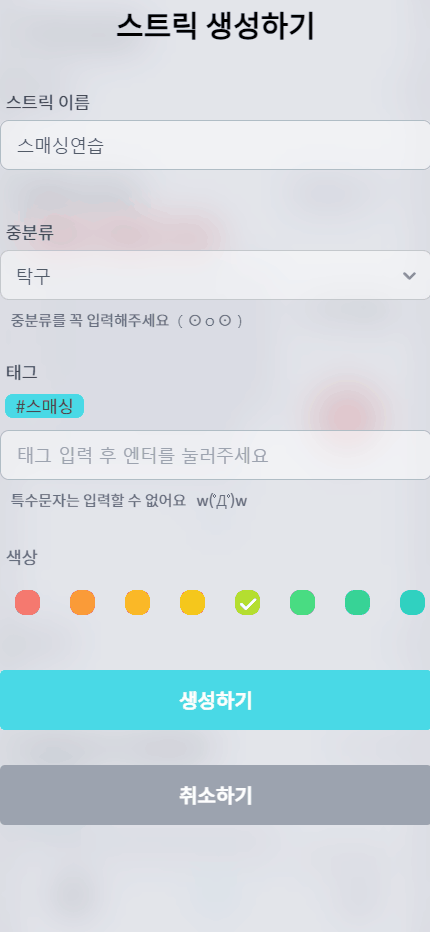 
<br>
- 스트릭 이름, 중분류, 태그 등 입력 후 스트릭 생성 가능
<br><br>

#### 스트리 수정
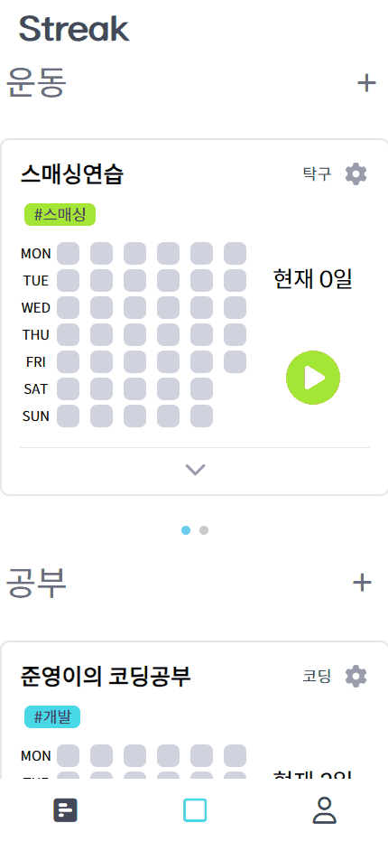 
<br>
- 스트릭 이름, 태그를 수정 할 수 있음
<br><br>

#### 스트릭 비활성화
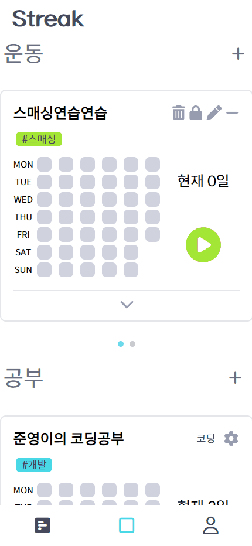 
<br>
- 활성화 되어있던 스트릭을 비활성화 할 수 있음
<br><br>

#### 스트릭 활성화
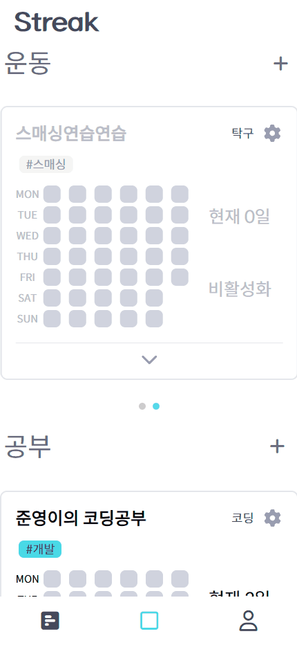 
<br>
- 비활성화 중이었던 스트릭을 활성화 가능
<br><br>

#### 스트릭 삭제
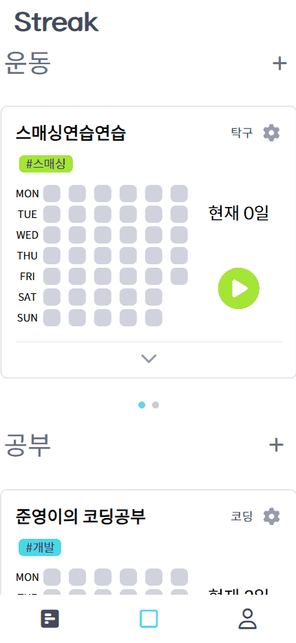 
<br>
- 삭제를 원하는 스트릭 삭제 가능
<br><br>

