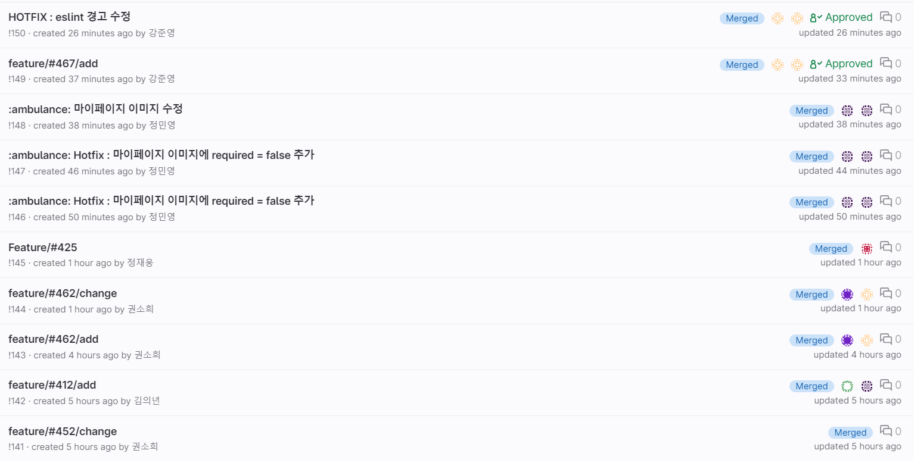

# 컨벤션
## 목차
[1. Commit Convention](#Commit-Convention) <br>
[2. Merge Convention ](#Merge-Convention) <br>
[3. BE Convention](#BE-Convention) <br>
[4. FE Convention](#FE-Convention) <br>
[5. JIRA Convention](#JIRA-Convetion) <br>
<hr>

### Commit Convention
#### 큰틀
    ```
    git commit -m ":sparkles: Feat : #태스트_지라_이슈_번호 태스크_이름

    - 추가 설명"
    ```

#### 예시
    ```
    git commit -m ":sparkles: Feat :#1 리드미 작성
    
    - 리드미를 작성했습니다."
    ```
#### 커밋 유형 지정
|커밋 유형|의미|아이콘|
|---------|------|-------|
|`Feat`|새로운 기능 추가|:sparkles:|
|`Fix`|버그 수정|:bug:|
|`Docs`|문서 수정|:memo:|
|`Style`|코드 formatting, 세미콜론 누락, 코드 자체의 변경이 없는 경우|-|
|`Refactor`|코드 리팩토링|:hammer:|
|`Test`|테스트 코드, 리팩토링 테스트 코드 추가|-|
|`Chore`|패키지 매니저 수정, 그 외 기타 수정|-|
|`Design`|CSS등 사용자 UI 디자인 변경|-|
|`Comment`|필요한 주석 추가 및 변경|-|
|`Rename`|파일 또는 폴더 명을 수정하거나 옮기는 작업|-|
|`Remove`|파일을 삭제하는 작업|-|
|`!BREAKING CHANGE`|커다란 API 변경의 경우|-|
|`!HOTFIX`|급하게 치명적인 버그를 고쳐야 하는 경우|:ambulance:|

#### 제목과 본문을 빈행으로 분리
- 커밋 유형 이후 제목과 본문은 한글로 작성하여 내용이 잘 전달될 수 있도록 할 것
- 본문에는 변경한 내용과 이유 설명
  - 무엇 & 왜 위주로 설명

#### 제목 첫 글자는 대문자, 끝에는 . 금지

#### 제목은 영문 기준 50자 이내로 할 것

#### 자신의 코드가 직관적으로 바로 파악할 수 있다고 생각하지 말자

#### 여러가지 항목기 있다면 글머리 기호를 통해 가독성 높이기
```
    - 글머리
    - 글머리
    - 글머리
```

#### 적용


### Merge Convention
#### 중요
```
포크 받은 개인레포에 feature 개발한 코드 push (한 기능에는 커밋 10개 이내)
```

#### 큰 틀
```
git add .
git commit -m "커밋 컨벤션"
git push origin 브랜치 이름
```

#### 기능 추가 - add
```
제목 : 브랜치 이름/add
내용 : 구현한 기능에 대한 상세한 설명(구현 기능의 목적과 주요 동작 설명)
```

#### 기능 수정 - change
```
제목 : 브랜치 이름/change
내용 : 변경된 기능에 대한 상세한 설명 (기능을 변경한 목적과 변경된 동작 설명)
```

#### 데이터 추가 - update
```
제목 : 브랜치 이름/update
내용 : 추가된 데이터에 대한 상세한 설명 (데이터를 추가한 목적과 변경된 동작 설명)
```

#### 코드 제거 - remove
```
제목 : 브랜치 이름/remove
내용 : 제거된 코드에 대한 상세한 설명 (코드를 제거한 목적과 변경된 동작 설명)
```

#### 데이터 제거 - delete
```
제목 : 브랜치 이름/delete
내용 : 제거된 데이터에 대한 상세한 설명 (데이터를 제거한 목적과 변경된 동작 설명)
```

#### 적용


### BE Convention
```
구글에서 제공하는 Convention 적용
```

### FE Convention
```
기본적으로 ESLint + prettier를 베이스로 함

useCallback과 useMemo와 같은 최적화를 위한 훅은 아직 사용이 서툴러서 이를 활용한 규칙들은 포함하지 않음
```

#### PascalCase
- 컴포넌트
- 클래스
- 인터페이스
- 타입
- enum
- 데코레이터
- 타입 파라미터
- 이미지 파일

#### camelCase
- 일반 변수
- 파라미터
- 함수 이름
- 메소드
- property
- 모듈

#### CONSTANT_CASE
- 상수
  - 상수가 한번이라도 변경될 가능성이 있다면 camelCase로 작성
- enum values를 포함한 변수

#### 모듈
- 불러온 모듈명이 스네이크 케이스여도 camelCase로 import

#### Aliases
- 특정 변수를 alias로 사용할 때에는 그 이름을 그대로 가져가 const로 선언
- 클래스 필드로 쓸 때에는 readonly필수

#### Any or Unknown
- any는 아무때나 쓸 수 있지만, typescript를 쓰는 의미가 없게 되어버릴 수 있음
- unknown을 어쩔 수 없이 써야할 상황이 있을 수도 있으나, 이를 사용하는 쪽에서의 방어처리를 해서 안전하게 사용가능
  - 타입 지정이 불가능할 때에는 unknown, 이외에는 타입 지정 필수

#### 화살표 함수 사용
```
// bad
const example = (user) => (
	<div>{user.name}</div>
)


// good
const example = (user) => {
	return (
		<div>{user.name}</div>
	)
}

// 주석은 쓰려는 구문에 맞춰 들여쓰기
// 주석 작성은 한칸 띄우고 쓰기 
```

#### Naming Styles/태그 규칙
- 변수의 복수명은 단수 + List
  - user/userList
- 따옴표는 홑따옴표 대신 쌍따옴표 ""
- 속성명은 camelCase
- 언제나 true값을 가지는 속성은 값 생략
- img 태그에는 항상 alt속성을 작성
- 배열의 인덱스를 key속성 값으로 사용하는 것을 피하고, 유니크한 ID값을 사용
- 자식 컴포넌트가 없으면 항상 닫힘태그를 사용

#### 정렬 방식
```
// bad
<Foo superLongParam="bar"
     anotherSuperLongParam="baz" />

// good
<Foo
  superLongParam="bar"
  anotherSuperLongParam="baz"
/>

// 만약 props가 하나면 같은 줄에 둔다.
<Foo bar="bar" />

// 자식 컴포넌트는 보통 들여쓴다.
<Foo
  superLongParam="bar"
  anotherSuperLongParam="baz"
>
  <Quux />
</Foo>
```

#### 연산자 사이에는 공백을 추가
```
a+b+c+d // bad
a + b + c + d // good
```

#### 콤마 다음에 값이 올 경우 공백을 추가
```
var arr = [1,2,3,4]; // bad
var arr = [1, 2, 3, 4]; // good
```

### JIRA Convention
#### 네이밍 컨벤션
```
[BE] 개발 내용
[FE] 개발 내용
[영역] 내용 (담장자)
```
